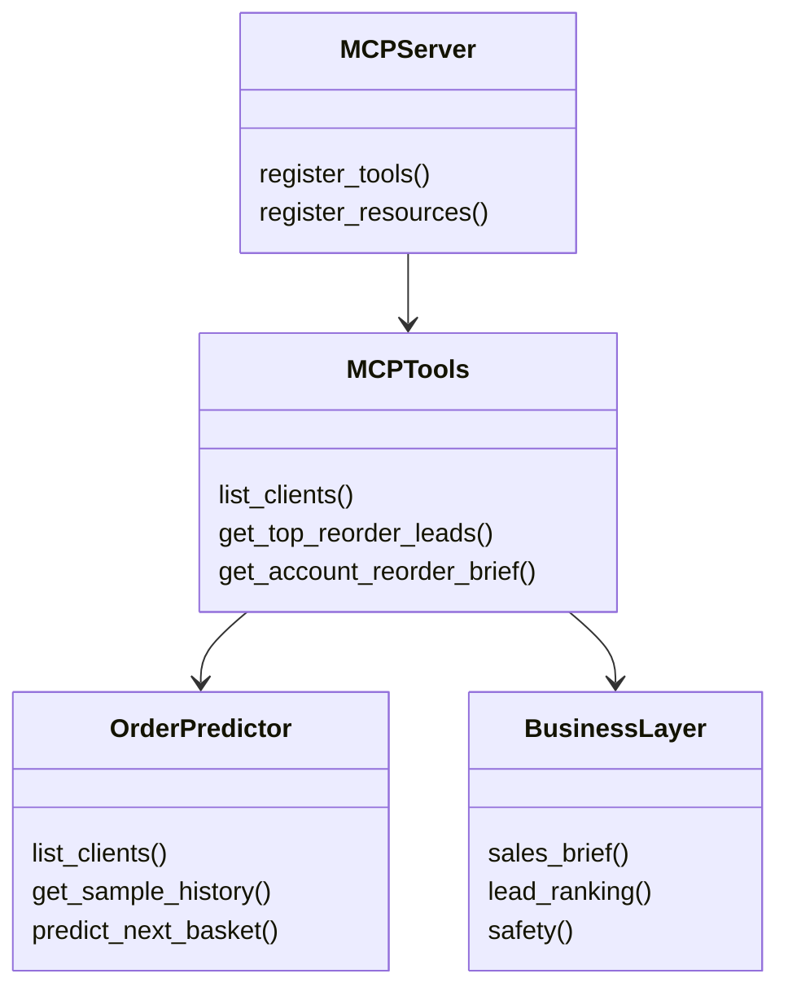

# B2B Next-Basket MCP Demo

A public, NDA-safe demo that exposes a local B2B next-basket prediction backend through an MCP server.

## What This Project Demonstrates

- Local prediction backend wrapped as MCP tools.
- Stdio MCP server for local MCP clients.
- Streamable HTTP MCP server for optional visual clients.
- Sales-facing tools for account briefs and ranked reorder leads.
- Proprietary assets are kept local and excluded from Git.

## Architecture

```text
Client
    |
    v
MCP server
    |
    v
Python tool layer
    |
    v
OrderPredictor
    |
    +-- dataset.joblib
    +-- model.onnx
    +-- protected backend
```



## MCP Tools

| Tool | Purpose | Audience | Sales-facing |
| --- | --- | --- | --- |
| `get_server_capabilities` | Describe server defaults, tools, and safety boundaries. | developer, demo | no |
| `list_clients` | List available local demo account IDs. | developer, demo | no |
| `get_sample_history` | Return a compact account-history preview. | developer, demo | no |
| `get_prediction_input_sample` | Return full prediction input for local development. | developer | no |
| `predict_next_basket` | Generate lower-level model prediction output. | developer | no |
| `recommend_next_action` | Wrap a prediction as a safe next-action recommendation. | developer, demo | yes |
| `get_account_reorder_brief` | Produce a sales-ready reorder brief for one account. | sales, demo | yes |
| `get_top_reorder_leads` | Rank reorder leads using demo heuristics over model outputs. | sales, demo | yes |

## Local Assets

This repository does not include proprietary model, data, or protected backend files.

Expected local files:

```text
data/model.onnx
data/dataset.joblib
vendor/protected_backend.py
vendor/protected_runtime/
vendor/pyarmor_runtime_000000/
```

Do not commit `data/`, `vendor/`, `*.onnx`, `*.joblib`, or local export folders.

To prepare local assets from the original package:

```bash
python scripts/prepare_local_assets.py "/path/to/extracted/Public Hackathon (NDA required)"
```

## Setup

Use Python 3.11.

```bash
python3.11 -m venv .venv
source .venv/bin/activate
pip install --upgrade pip
pip install -r requirements.txt
```

## Run MCP Servers

Stdio server:

```bash
PYTHONPATH=src python scripts/run_mcp_server.py
```

Streamable HTTP server:

```bash
PYTHONPATH=src python scripts/run_mcp_http_server.py
```

Default local HTTP endpoint:

```text
http://127.0.0.1:8010/mcp
```

## Smoke Tests

```bash
PYTHONPATH=src python scripts/mcp_dev_client.py
PYTHONPATH=src python scripts/mcp_sales_demo_client.py
PYTHONPATH=src python scripts/mcp_http_smoke_client.py
PYTHONPATH=src python scripts/test_top_leads_tool.py
```

## Optional n8n Visual Demo

The separate sibling project `b2b-next-basket-n8n-demo` contains visual n8n workflows that call this MCP server over streamable HTTP. This repository does not require n8n to run the MCP server.

Recommended no-AI workflow in the sibling project:

```text
../b2b-next-basket-n8n-demo/workflows/b2b_next_basket_mcp_capability_explorer.workflow.json
```

The exact n8n-facing MCP URL depends on the local Docker networking setup. In my current rootless-Docker demo setup, the proxied URL is:

```text
http://172.19.0.1:18010/mcp
```

The Ollama workflow is an optional extension. The MCP capability explorer does not require OpenAI or Ollama.

## Dataset and Account Identity

- The demo dataset has 169 account records.
- Most account names are numeric IDs.
- Safe display labels are generated for demo readability.
- Production use needs CRM or ERP metadata mapping.

## Safety Notes

- Tool output is recommendation-only.
- No tool places orders or contacts customers automatically.
- No calibrated confidence score is claimed.
- Internal reasoning is not exposed; tools return reason codes, evidence summaries, limitations, and safety fields.
- Demo display names are safe labels, not CRM-verified company names.
- Production use would require CRM or ERP account metadata, permissions, ownership, audit logging, and review workflows.

## Git Hygiene

Do not commit:

- `data/`
- `vendor/`
- `dataset_export/`
- local screenshots
- Playwright artifacts
- `*.onnx`
- `*.joblib`
