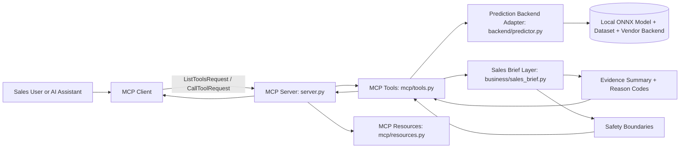

# Architecture

This project wraps a local next-basket prediction capability as a Model Context Protocol server. The code is organized so the MCP interface, prediction backend, business explanation layer, and local-only model assets have separate responsibilities.

## Main Pieces

- MCP client: a local script or MCP-aware assistant that sends `ListToolsRequest` and `CallToolRequest` messages over stdio.
- MCP server: `src/b2b_next_basket_mcp/server.py` creates the `FastMCP` app, registers tools and resources, and runs the stdio server.
- MCP tools: `src/b2b_next_basket_mcp/mcp/tools.py` defines the public tool functions and keeps predictor loading lazy.
- MCP resources: `src/b2b_next_basket_mcp/mcp/resources.py` exposes lightweight documentation resources such as the model card.
- Prediction backend adapter: `src/b2b_next_basket_mcp/backend/predictor.py` loads the local dataset and ONNX model, calls the protected backend objects, and returns generated token output.
- Business layer: `src/b2b_next_basket_mcp/business/sales_brief.py` converts predicted items and timing into recommendation-only sales language.
- Evidence and safety layer: `business/evidence.py` and `business/safety.py` provide reason codes, model signals, limitations, and explicit action boundaries.
- Token utilities: `utils/token_utils.py` converts compact model tokens into readable item and timing labels.
- Config: `config.py` centralizes server name and default generation values.

## Local-only Assets

The public repository does not include protected model/data/backend files. These assets stay local and ignored by Git:

- `data/model.onnx`
- `data/dataset.joblib`
- `vendor/protected_backend.py`
- `vendor/protected_runtime/`
- `vendor/pyarmor_runtime_000000/`

The MCP layer does not expose raw dataset internals, protected backend details, or ONNX session internals through tools.

## High-level Flow



## Runtime Behavior

`scripts/run_mcp_server.py` starts the stdio server. The server may appear idle when run directly because it waits for MCP protocol messages on stdin/stdout.

The predictor is loaded lazily on the first prediction-related tool call. Importing `server.py` and listing tools should not load the model or dataset.

The sales demo command is:

```bash
PYTHONPATH=src .venv/bin/python scripts/mcp_sales_demo_client.py
```

That client starts the MCP server as a subprocess, lists tools, calls `get_server_capabilities`, and then calls `get_account_reorder_brief`.

