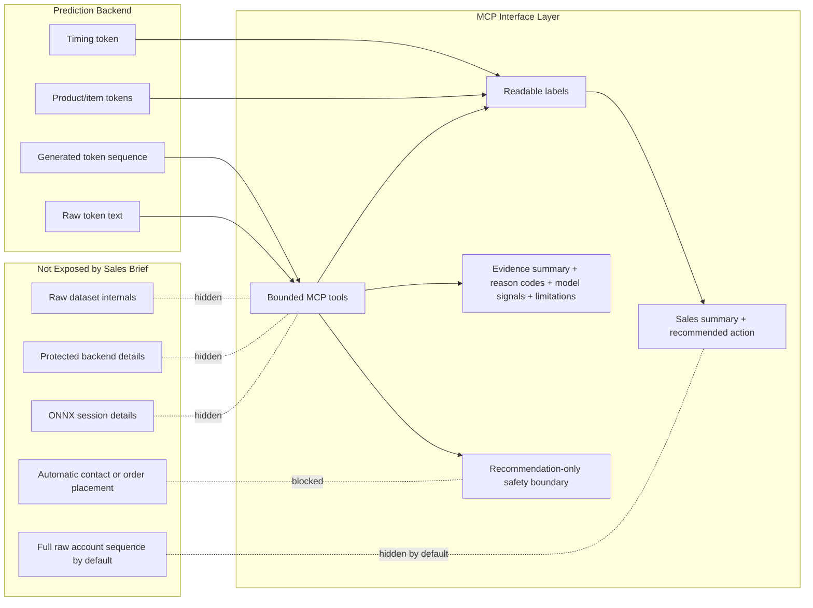

# Model to MCP Mapping

The prediction backend and the MCP layer have different responsibilities. The backend generates sequence output. The MCP layer turns that capability into bounded, structured tools for a sales-facing workflow.

## Backend Output

The original backend/model path can produce:

- generated token sequence
- timing token
- product or item tokens
- raw token text

These outputs are useful to the system, but they are not a complete product interface.

## MCP Layer Adds

The MCP layer adds:

- readable labels
- sales summary
- recommended action
- talking points
- evidence summary
- reason codes
- model signals
- limitations
- safety boundary

Chain-of-thought is not exposed. The server exposes evidence summaries, reason codes, model signals, and limitations instead.

## MCP Layer Hides or Masks

The MCP layer hides or masks:

- raw dataset internals
- protected backend details
- ONNX session details
- full raw account sequence by default
- automatic customer contact
- automatic order placement

Full raw prediction input is only available through a development/demo helper tool, not through the sales-facing reorder brief.

## MCP Layer Exposes

The MCP layer exposes:

- bounded tools
- structured arguments
- structured responses
- account reorder brief
- server capabilities
- safety boundaries

## Mapping Diagram

## Tool-level Example

`get_account_reorder_brief` accepts a `client_id` and display options. It returns a structured response containing:

- `prediction.expected_timing`
- `prediction.readable_items`
- `sales_brief.summary`
- `sales_brief.recommended_action`
- optional `sales_brief.talking_points`
- optional `evidence.reason_codes`
- optional `evidence.evidence_summary`
- optional `evidence.model_signals`
- optional `evidence.limitations`
- `safety`

The response is recommendation-only and does not imply calibrated confidence, customer contact, or order placement.

