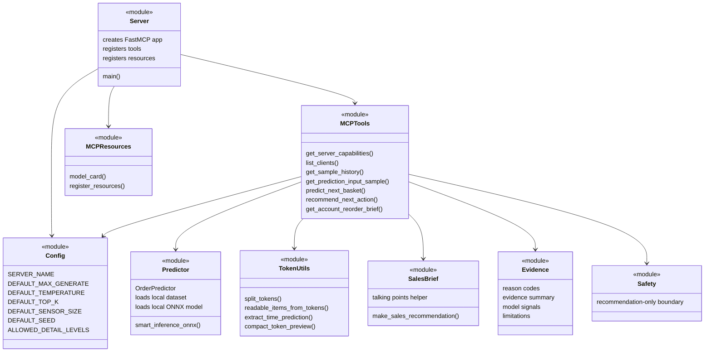

# Module Responsibilities

This diagram shows module-level responsibilities after the refactor. It is intentionally simple and focuses on boundaries rather than implementation details.

## Boundary Notes

- `server.py` owns app setup, not prediction or business logic.
- `mcp/tools.py` owns MCP tool behavior and lazy predictor loading.
- `backend/predictor.py` owns model and dataset access.
- `business/` owns sales wording, evidence summaries, and safety boundaries.
- `utils/token_utils.py` owns token parsing and readable conversion.
- `data/` and `vendor/` remain local-only and are not public source modules.

